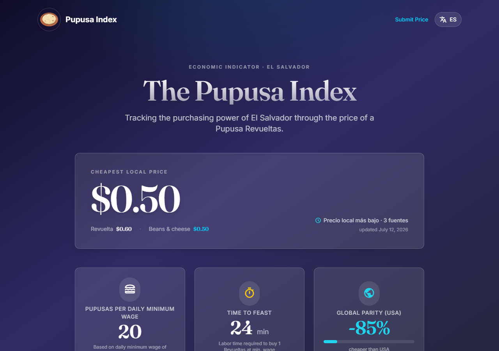

# 🫓 The Pupusa Index 🇸🇻

> **The unofficial economic indicator of El Salvador.**

**[👉 Try it live: pupusa-index.vercel.app](https://pupusa-index.vercel.app)**

## Why it exists

Official inflation numbers are slow, abstract, and disconnected from daily life. Nobody feels a CPI basket — but everybody in El Salvador knows what a pupusa costs, because everybody eats them, rich or poor. That makes the pupusa a near-perfect informal price index: relatable, universal, and impossible to fake.

Inspired by *The Economist*'s Big Mac Index, the Pupusa Index tracks that one real number — scraped from actual vendors every month, not surveyed or estimated — and turns it into something people can actually use:

- 📈 **Price history** — watch the real cost of living move, month over month
- 🧮 **Budget calculator** — how many pupusas can you actually buy?
- 🌎 **Global parity** — how local purchasing power stacks up internationally
- ⏱️ **Labor time metric** — how many minutes of minimum-wage work buy one pupusa
- 🗣️ **Community submissions** — real people reporting real prices they've seen

Built for the Salvadoran diaspora tracking the cost of home, journalists and economists who need a fast honest signal, and anyone curious what purchasing power actually feels like — not what a spreadsheet says it is.

## 🤝 Contributing

Spotted a price that's off, or have an idea to improve the index? PRs and issues are welcome.

For local setup, environment variables, and database/cron configuration, see [`DEVELOPMENT.md`](DEVELOPMENT.md).

---

Made with ❤️ and 🌽 in El Salvador.
